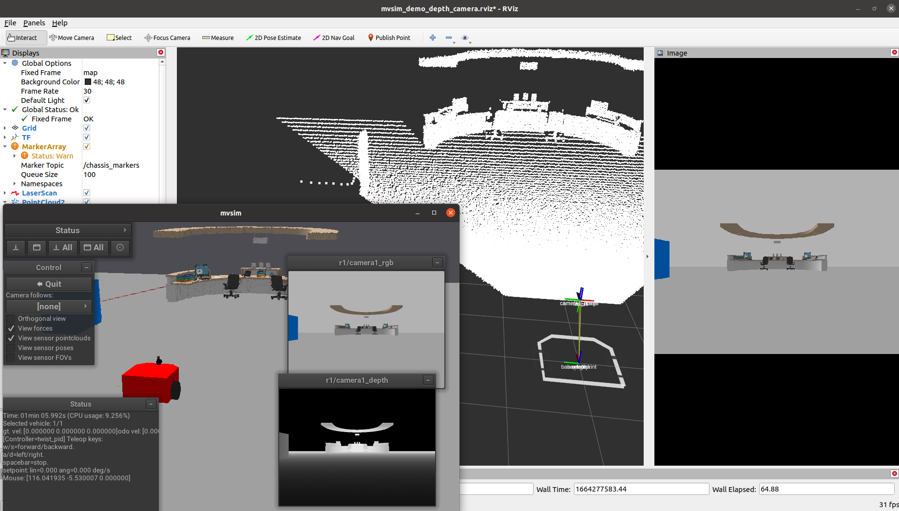

 

| Distro | Build dev | Build releases | Stable sync |
| ---    | ---       | ---            | ---         |
| ROS1 Melodic (u18.04) |  |  |  |
| ROS1 Noetic (u20.04) |  |    |  |
| ROS2 Foxy (u20.04) |  |   |  |
| ROS2 Humble (u22.04) |  |   |  |
| ROS2 Rolling (u22.04) |  |    |  |

MultiVehicle simulator (libmvsim)
======================================
Lightweight, realistic dynamical simulator for 2D ("2.5D") vehicles and robots.
It is tailored to analysis of vehicle dynamics, wheel-ground contact forces and accurate simulation of typical robot sensors (e.g. 2D and 3D lidars).

This package includes the C++ library `mvsim`, a standalone app and a ROS node.

License: 3-clause BSD License
Copyright (C) 2014-2022 Jose Luis Blanco <jlblanco@ual.es> (University of Almeria) and collaborators

Docs
----------
  * [Main documentation site](https://mvsimulator.readthedocs.io/en/latest/)
  * https://wiki.ros.org/mvsim
  
Launch demos
--------------

Standalone:

    mvsim launch mvsim_tutorial/mvsim_demo_2robots.world.xml
    
    mvsim launch mvsim_tutorial/test_mesh.world.xml

ROS1:

    roslaunch mvsim mvsim_demo_depth_camera.launch

ROS2:

    ros2 launch mvsim mvsim_demo_depth_camera.launch.py

Main features
--------------
  * Lightweight in memory, CPU and library requirements.
  * Fully configurable via `.xml` "world" files.
  * World maps:
    * Occupancy gridmaps: input as images or MRPT binary maps (from icp-slam, rbpf-slam, etc.)
    * Elevation meshes.
  * Vehicle models:
    * Differential driven (2 & 4 wheel drive).
    * Ackermann steering (kinematic & dynamic steering, different mechanical drive models).
    * Ackermann steering with mechanical differentials of full grade.
  * Sensors:
    * Laser scanners: Robots see each other, their own bodies, etc.
    * RGB cameras
    * Depth cameras
  * Interface to vehicles: Choose among:
    * Raw access to forces and motor torques.
    * Twist commands (using internal controllers).

