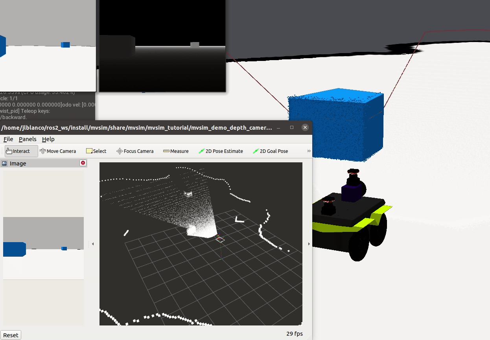

 

MultiVehicle simulator (MVSIM)
======================================
Lightweight, realistic dynamical simulator for 2D ("2.5D") vehicles and robots.
It is tailored to analysis of vehicle dynamics, wheel-ground contact forces and accurate simulation of typical robot sensors (e.g. 2D and 3D lidars).

This package includes C++ libraries, standalone applications, and ROS 1 and ROS 2 nodes.

License: 3-clause BSD License
Copyright (C) 2014-2023 Jose Luis Blanco <jlblanco@ual.es> (University of Almeria) and collaborators

Please, refer to [the MVSim paper](https://arxiv.org/abs/2302.11033) for a gentle introduction
to the project architecture.
If you want to cite MVSim in your work, please use:

    @misc{mvsim,
      doi = {10.48550/ARXIV.2302.11033},
      url = {https://arxiv.org/abs/2302.11033},
      author = {Blanco-Claraco, José-Luis and Tymchenko, Borys and Mañas-Alvarez, Francisco José and Cañadas-Aránega, Fernando and López-Gázquez, Ángel and Moreno, José Carlos},  
      title = {MultiVehicle Simulator (MVSim): lightweight dynamics simulator for multiagents and mobile robotics research},  
      publisher = {arXiv},
      year = {2023}
    }

Installation
--------------------

See [installation documentation](https://mvsimulator.readthedocs.io/en/latest/install.html) for all the details and options. 

The easiest way to install if you already have ROS 1 or ROS 2 is:

    sudo apt install ros-$ROS_DISTRO-mvsim

Then jump to [next steps](https://mvsimulator.readthedocs.io/en/latest/first-steps.html) to see how to launch some of the demo worlds.

Demo videos
--------------------

Build matrix status
--------------------

| Distro | Build dev | Build releases | Stable sync |
| ---    | ---       | ---            | ---         |
| ROS 1 Melodic (u18.04) |  |  |  |
| ROS 1 Noetic (u20.04) |  |    |  |
| ROS 2 Foxy (u20.04) |  |   |  |
| ROS 2 Humble (u22.04) |  |   |  |
| ROS 2 Rolling (u22.04) |  |    |  |

Docs
----------
  * [Main documentation site](https://mvsimulator.readthedocs.io/en/latest/)
  * https://wiki.ros.org/mvsim

If you clone this repository, remember to checkout the git submodules too:

    git clone https://github.com/MRPT/mvsim.git --recursive

Launch demos
--------------

See more on first steps [here](https://mvsimulator.readthedocs.io/en/latest/first-steps.html).

Standalone:

    mvsim launch mvsim_tutorial/demo_warehouse.world.xml
    mvsim launch mvsim_tutorial/demo_2robots.world.xml
    mvsim launch mvsim_tutorial/test_mesh.world.xml

ROS 1:

    roslaunch mvsim demo_depth_camera.launch

ROS 2:

    ros2 launch mvsim demo_warehouse.launch.py
    ros2 launch mvsim demo_depth_camera.launch.py

Main features
--------------
  * Lightweight in memory, CPU and library requirements.
  * Fully configurable via `.xml` "world" files.
  * Headless mode, suitable for dockerized environments.
  * World maps:
    * Occupancy gridmaps: input as images or MRPT binary maps (from icp-slam, rbpf-slam, etc.)
    * Elevation meshes.
  * Vehicle models:
    * Differential driven (2 & 4 wheel drive).
    * Ackermann steering (kinematic & dynamic steering, different mechanical drive models).
    * Ackermann steering with mechanical differentials of full grade.
  * Sensors:
    * 2D and 3D Lidars: Robots see each other, their own bodies, etc.
    * RGB cameras
    * Depth cameras
  * Interface to vehicles: Custom Python interface, or ROS. Choose among:
    * Raw access to forces and motor torques.
    * Twist commands (using internal controllers).

