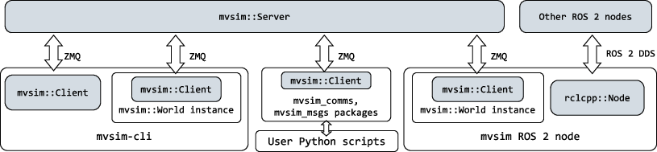

.. .. _architecture:

Architecture
=================================

Please, refer to `the MVSim paper <https://arxiv.org/abs/2302.11033>`_
for a gentle introduction to the project architecture.

   Overview of the different possibilities to communicate with a running MVSim instance.

The project comprises:

- C++ libraries: ``libmvsim_comms``, ``libmvsim_msgs``, ``libmvsim_simulator``.
- A ROS 1 and ROS 2 node (both in the same git branch).
- Python3 wrappers.
- ``mvsim-cli``: A standalone program to run the simulation and, optionally,
  displaying a GUI live view of the world, accept keyboard/mouse orders, etc. 
  It also uses ZMQ+protobuf as a communication system for user programs to 
  interact with the simulation (for example, from a C++ or Python program).

