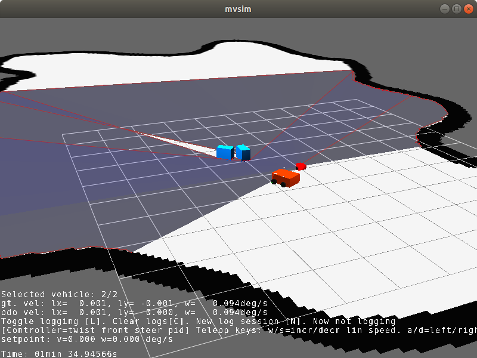

First steps
===================

After installing or building from sources, you are ready to test the
standalone simulator applications to get used to MVSIM.

1. Manual vehicle teleop
-------------------------

.. code-block:: bash

    build/bin/mvsim-server mvsim_tutorial/mvsim_demo_2robots.world.xml

You should see the GUI of a demo world with two robots equipped with a 2D
lidar, scanning a model defined by means of an occupancy grid map and a couple
of boxes.

Use the keyboard to teleop the vehicle: ``w/s`` to increase/decrease the
PI controller setpoint linear speed, and ``a/d`` to turn the Ackermann steering
to the left/right. Use the spacebar as a brake.

Select the active robot by pressing the keys ``1`` or ``2``.

   Screenshot of the ``mvsim_demo_2robots`` example world.

.. note::
    The GUI of this program is likely to change soon.
