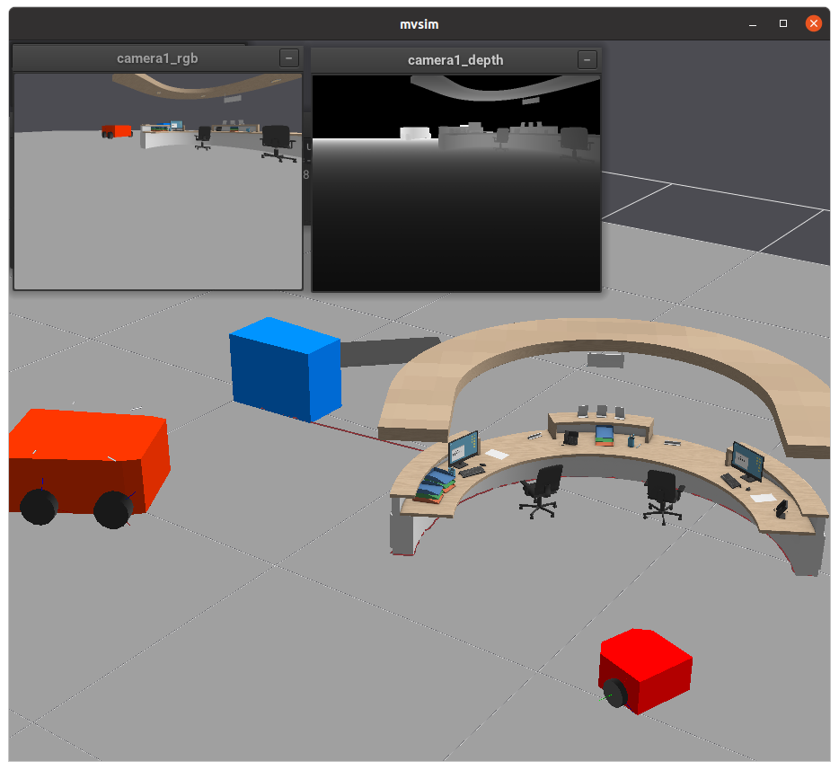
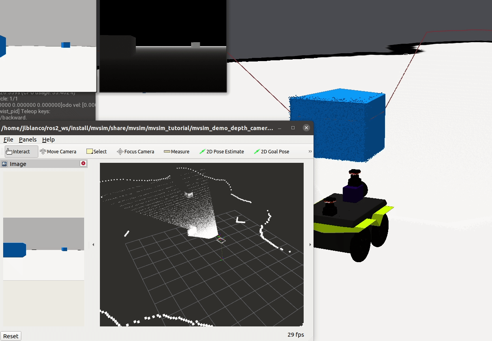

First steps
===================

After installing or building from sources, you are ready to test the
standalone simulator applications to get used to MVSIM.

1. Manual vehicle teleop
---------------------------

.. code-block:: bash

    mvsim launch mvsim_tutorial/demo_2robots.world.xml

You should see the GUI of a demo world with two robots equipped with a 2D
lidar, scanning a model defined by means of an occupancy grid map and a couple
of boxes.

Use the keyboard to teleop the vehicle: ``w/s`` to increase/decrease the
PI controller setpoint linear speed, and ``a/d`` to turn the Ackermann steering
to the left/right. Use the spacebar as a brake.

Select the active robot by pressing the keys ``1`` or ``2``.

   Screenshot of the ``demo_2robots`` example world.

2. ROS launch files
---------------------------

Once the ROS1 or ROS2 mvsim package is installed, you should be able 
to launch one of `the many demo files <https://github.com/MRPT/mvsim/tree/master/mvsim_tutorial>`_, 
for example:

.. code-block:: bash

    # For ROS1:
    roslaunch mvsim demo_jackal.launch

    # For ROS2:
    ros2 launch mvsim demo_jackal.launch.py

   Screenshot of the ``demo_jackal`` ROS demo.

