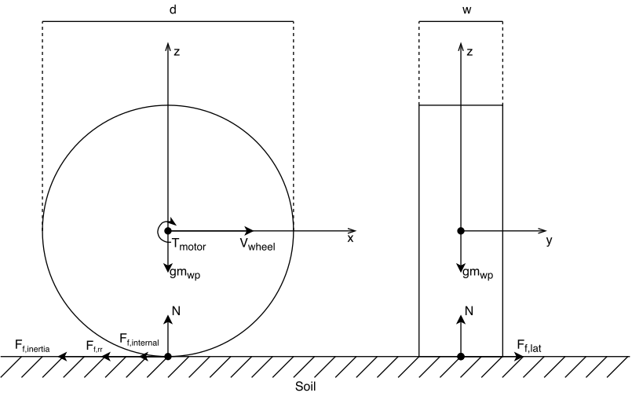

Physic models
==============

1. Wheel dynamics
------------------

We introduce wheels as a mass with cylindrical shape (Figure
[fig:wheel\_forces]). Each wheel has following properties:

-  location of the wheel as to the chassis ref point [m,rad] in local
   coordinates :math:`L_w = \{ x_w, y_w, \Phi \}`

-  diameter :math:`d_w` [m]

-  width :math:`w_w` [m]

-  mass :math:`m_w` [kg]

-  inertia :math:`I_{yy}`

-  spinning angular position :math:`\phi_w` [rad]

-  spinning angular velocity :math:`\omega_w` [rad/s]

Thus, each wheel is represented as
:math:`W = \{L_w, d_w, w_w, m_w, I_{yy}, \phi_w, \omega_w\}`

   Wheel forces

2. Friction models
-------------------

Friction models base
~~~~~~~~~~~~~~~~~~~~

Friction model base introduces *Friction input* structure, that
incorporates forces of wheel

-  weight on this wheel from the car chassis, excluding the weight of
   the wheel itself :math:`w` [N]

-  motor torque :math:`\tau` [Nm]

-  instantaneous velocity

   .. math::

      \nu = \begin{bmatrix}
      \nu_x \\
      \nu_y
      \end{bmatrix}

   in local coordinate frame

Default friction
~~~~~~~~~~~~~~~~

At the moment, there is only one basic friction model available for
vehicles. Default friction model evaluates ...

Default friction evaluates forces in the wheel coordinate frame:

.. math::

   \nu_w =
   \begin{bmatrix}
   \nu_{wx} \\
   \nu_{wy}
   \end{bmatrix}
   =R(\Phi_w) \cdot \nu

To calculate maximal allowed friction for the wheel, we introduce
partial mass:

.. math:: m_{wp} = \frac{w_w}{g} + m_w

.. math:: F_{f, max} = \mu \cdot m_{wp} \cdot g

Where :math:`\mu` is friction coefficient for wheel.

Calculating latitudinal friction (decoupled sub-problem):

.. math:: F_{f,lat} = m_{wp} \cdot a = m_{wp} \cdot \frac{-\nu_{wy}}{\Delta t}

.. math:: F_{f,lat} = max(-F_{f,max}, min(F_{f,lat}, F_{f,max}))

Calculating wheel desired angular velocity:

.. math:: \omega_{constraint} = \frac{2\nu_{wx}}{d_w}

.. math:: J_{desired} = \omega_{constraint} - \omega_w

.. math:: \omega_{desired} = \frac{J_{desired}}{\Delta t}

Calculating longitudinal friction:

.. math:: F_{f,lon} = \frac{1}{R} \cdot (\tau - I_{yy}\cdot \omega_{desired} - C_{damp} \cdot \omega_w)

.. math:: F_{f,lon} = max(-F_{f,max}, min(F_{f,lon}, F_{f,max}))

Simply composing friction forces to vector:

.. math::

   F_f =
   \begin{bmatrix}
   F_{f,lat} \\
   F_{f,lon}
   \end{bmatrix}

With new friction, we evaluate angular acceleration *(code says angular
velocity impulse, but the units are for acceleration)* of the wheel:

.. math:: \alpha = \frac{ \tau - R \cdot F_{f,lon} - C_{damp} \cdot \omega_w}{I_{yy}}

Using given angular acceleration, we update wheel’s angular velocity:

.. math:: \omega_w = \omega_w + \alpha \cdot \Delta t

Ward-Iagnemma friction
~~~~~~~~~~~~~~~~~~~~~~

This type of friction is an implementation of paper from Chris Ward and
Karl Iagnemma :cite:`ward2008dynamic`.

Rolling resistance is generally modeled as a combination of static- and
velocity-dependant forces [17], [21]. Authors propose function with form
similar to Pacejka’s model as a
continuously differentiable formulation of the rolling resistance with
the static force smoothed at zero velocity to avoid a singularity. The
rolling resistance is

.. math::

   F_{rr} = −sign(V_{fwd}) \cdot N \cdot (R_1 \cdot (1 − e^{−A_{roll} |V_{fwd} |}
   )+R_2 \cdot |V_{fwd}|)

Where :math:`A_{roll}`, :math:`R_1`, :math:`R_2` are the model-dependent
coefficients. The impact of these coefficients is shown at figure
[fig:wi\_rr] taken from original paper.

This force :math:`F_{rr}` is then added to :math:`F_{f,lon}`.

Default constants were chosen as in reference paper and showed good
stability and robust results. In addition, they can be altered via
configuration file.

3. Vehicle models
-------------------

Vehicle models are fully configurable with world XML files.

Vehicle base class
~~~~~~~~~~~~~~~~~~

Vehicle base incorporates basic functions for every vehicle actor in the
scene. It is also responsible for updating state of vehicles.

It has implementation of interaction with world. Derived classes
re-implement only work with torques/forces on wheels.

At the moment, no model takes into account the weight transfer, so
weight on wheels is calculated in this base class.

Vehicle base class also provides ground-truth for velocity and position.

.. math:: p_w = \frac{p_{chassis}}{N_w}

-  Before time step:

   -  Update wheels position using Box2D

   -  Invoke motor controllers (reimplemented in derived classes)

   -  Evaluate friction of wheels with passed friction model

   -  Apply force to vehicle body using Box2D

-  Time step - update internal vehicle state variables :math:`q` and
   :math:`\dot{q}`

-  After time step - updates wheels rotation

Center of mass is defined as center of Box2D shape, currently there is
no +Z mobility.

Differential driven
~~~~~~~~~~~~~~~~~~~

A differential wheeled robot is a mobile robot whose movement is based
on two separately driven wheels placed on either side of the robot body.
It can thus change its direction by varying the relative rate of
rotation of its wheels and hence does not require an additional steering
motion.

*Odometry-based velocity estimation* is implemented via Euler formula
(consider revising, it doesn’t include side slip):

.. math:: \omega_{veh} = \frac{\omega_r \cdot R_r - \omega_l \cdot R_r}{y_r - y_l}

.. math:: \nu_x = \omega_l \cdot R_l + \omega \cdot y_l

.. math:: \nu_y = 0

Where :math:`\omega_{veh}` is angular velocity of the robot,
:math:`R_i` - radius of the wheel, :math:`y_i` is the y position of the
wheel, :math:`\omega_i` is the angular velocity of the wheel. All
calculations in the robot’s local frame.

*Nothing more interesting here.*

Ackermann driven
~~~~~~~~~~~~~~~~

Ackermann steering geometry is a geometric arrangement of linkages in
the steering of a car or other vehicle designed to solve the problem of
wheels on the inside and outside of a turn needing to trace out circles
of different radii.

*Ackermann wheels’ angles* are computed as following:

.. math:: \alpha_{outer} = atan(cot(|\alpha| + \frac{w}{2l})

.. math:: \alpha_{inner} = atan(cot(|\alpha| - \frac{w}{2l})

where :math:`\alpha` is the desired equivalent steering angle,
:math:`w` is wheels distance and :math:`l` is wheels base. Outer and
inner wheel are defined by the turn direction.

*Odometry-based velocity estimation* is implemented via Euler formula
(consider revising, it doesn’t include side slip):

.. math:: \omega_{veh} = \frac{\omega_{rr} \cdot R_{rr} - \omega_{rl} \cdot R_{rr}}{y_{rr} - y_{rl}}

.. math:: \nu_x = \omega_{rl} \cdot R_{rl} + \omega \cdot y_{rl}

.. math:: \nu_y = 0

where :math:`\omega_{veh}` is angular velocity of the robot,
:math:`R_{ri}` - radius of the rear wheel, :math:`y_{ri}` is the y
position of the rear wheel, :math:`\omega_{ri}` is the angular velocity
of the rear wheel. All calculations in the robot’s local frame.

Ackermann-driven with drivetrain
~~~~~~~~~~~~~~~~~~~~~~~~~~~~~~~~

This type of dynamics has the same geometry as simple Ackermann-driven
robots. However, its powertrain is completely different.

Instead of one “motor” per wheel, this type of dynamics incorporates one
“motor” linked to wheels by differentials.

There are two types of differentials:

-  Open differntial

-  Torsen-like locking differential
   :cite:`chocholek1988development`

Each type of differential can be linked with following configurations:

-  Front drive

-  Rear drive

-  4WD

Split is customizable between all axes.

As engine plays controller, whose torque output is then fed into
differentials.

For open differential act the following equations:

.. math:: \tau_{FL} = \tau_{motor} \cdot K_{s,f} \cdot K_{s,frl}

.. math:: \tau_{FR} = \tau_{motor} \cdot K_{s,f} \cdot (1 - K_{s,frl})

.. math:: \tau_{RL} = \tau_{motor} \cdot K_{s,r} \cdot K_{s,rrl}

.. math:: \tau_{RR} = \tau_{motor} \cdot K_{s,r} \cdot (1 - K_{s,frl})

Where :math:`K_{s,f}, K_{s,frl}, K_{s,rrl}` are split coefficients
between axes.

Different things happen for Torsen-like differentials. As this type is
self-locking, its torque output per wheel depends on wheel’s velocity.
Here is the function of selecting torque on the next time step based on
previous time step velocity. First, introduce the bias ratio - the ratio
indicating how much more torque the Torsen can send to the tire with
more available traction, than is used by the tire with less traction.
This ratio represents the “locking effect” of the differential. By
default, it is set to :math:`b = 1.5`

:math:`\omega_1, \omega_2` and :math:`t_1, t_2` are the output axles
angular velocities and torque splits respectively. :math:`K_s` is
differential split when it is not locked.

.. math:: \omega_{max} = max(|\omega_1|, |\omega_2|)

.. math:: \omega_{min} = min(|\omega_1|, |\omega_2|)

.. math:: \delta_{lock} = \omega_{max} - b \cdot \omega_{min}

.. math::

   \delta_t =
   \begin{cases}
       \delta_{lock} \cdot \omega_{max}, & \mbox{if } \delta_{lock} >  0 \\
       0, & \mbox{if } \delta_{lock} \leq 0
   \end{cases}

.. math::

   f_1 =
   \begin{cases}
       K_s \cdot (1 - \delta_t) & \mbox{if } |\omega_1| - |\omega_2| > 0 \\
       K_s \cdot (1 + \delta_t)
   \end{cases}

.. math::

   f_2 =
   \begin{cases}
       (1 - K_s) \cdot (1 + \delta_t) & \mbox{if } |\omega_1| - |\omega_2| > 0 \\
       (1 - K_s) \cdot (1 - \delta_t)
   \end{cases}

.. math:: t_1 = \frac{f_1}{f_1 + f_2}

.. math:: t_2 = \frac{f_2}{f_1 + f_2}

Torque delivery for 2WD is pretty straightforward. There is one input
from “motor” and two outputs to wheels, so wheel torques are:

.. math:: \tau_i = \tau_{motor} \cdot t_i

where :math:`t_i` is the output of Torsen differential for :math:`i`-th
wheel.

With 4WD, torque is first split with Torsen to front and rear parts,
each of them is than split independently with another Torsen.

At the moment, there is no model of the engine and thus no feedback of
tires torque to engine.

4. Controllers
----------------

Different vehicles have different controllers. At the moment,
differential and Ackermann drives have their own controllers.

Controllers are divided into several types:

-  Raw forces

-  Twist

Ackermann has controller, which controls steering angle and speed.

Controllers’ input and output are described by dynamics’ classes that
they use.

Differential raw controller
~~~~~~~~~~~~~~~~~~~~~~~~~~~

This type of controller has simple response to user’s input integrating
wheel torque with each simulation frame.

Differential Twist controller
~~~~~~~~~~~~~~~~~~~~~~~~~~~~~

Differential twist controller uses PID regulator to control linear and
angular speed of the robot.

Setpoints for :math:`v_r` and :math:`v_l` are calculated as following:

.. math:: v_l = \nu - \frac{\omega}{2} \cdot w

.. math:: v_r = \nu + \frac{\omega}{2} \cdot w

where :math:`\nu` is desired linear velocity and :math:`\omega` is
desired angular velocity.

Inverted formula are suitable to get actual velocities from odometry
estimates.

Then, velocity of the wheels is controlled with PID regulator.

Ackermann raw controller
~~~~~~~~~~~~~~~~~~~~~~~~

As a raw differential controller, raw Ackermann controller integrates
user input and sets wheel torques and steering wheel angle.

Ackermann twist controller
~~~~~~~~~~~~~~~~~~~~~~~~~~

Ackermann twist controller uses PID regulator to control wheel torques
responding to angular and linear velocity commands. Turn radius and
desired steering angle are calculated:

.. math:: R = \frac{\nu_s}{\omega_s}

.. math:: \alpha = atan(\frac{w}{r})

Desired velocities for wheels are computed by rotating desired linear
velocity to the steering angle. In the same way, actual velocities from
“odometry” are computed.

Then, torque of separate wheels is controlled with PID regulators for
each wheel.

Ackermann steering controller
~~~~~~~~~~~~~~~~~~~~~~~~~~~~~

Ackermann steering controller takes as input linear speed an steering
angle.

Then, it executes Ackermann twist controller to control wheels’ torques.

Ackermann-drivetrain controllers
~~~~~~~~~~~~~~~~~~~~~~~~~~~~~~~~

These controllers’ steering is identical to Ackermann contollers,
however, their torque part is different.

These controllers’ output acts like ’engine’ for drivetrain. Instead of
separate outputs to wheels, it has one torque output to differentials
that will split it to separate wheels.
