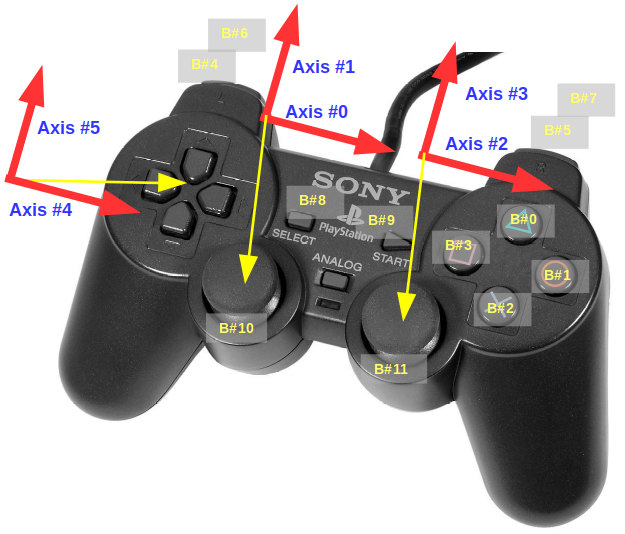

.. _teleoperation:

Teleoperating robots
--------------------------------------------

In MVSim, all robots or vehicles need to be assigned a **controller**
(read :ref:`Motion controllers`).
If you are running MVSim as a ROS node, most such controllers
accept motion commands sent to the topic ``/cmd_vel`` as with any other robot or simulator.

If no data is being published to ``/cmd_vel``, or if you run MVSim without ROS support,
three alternative methods can be used to move the robots:

- Via ZMQ messages using the MVSim built-in messaging protocol (Write me!).
  See a `Python code example <https://github.com/MRPT/mvsim/blob/develop/mvsim_tutorial/python/mvsim-teleop.py>`_.
- Joystick, if present (see below).
- Keyboard, from the MVSim GUI (see below).

Joystick
===========

For joystick control to work, you must:

- Make sure your world XML file has a global flag ``<joystick_enabled>`` set to ``true``,
  since that property is disabled by default (see :ref:`Top-level and global simulation settings`).
- Plug in a joystick before launching MVSim.

Use one of these vehicle kinematics and controllers (read :ref:`Motion controllers`):

- ``DynamicsAckermann``: ``ControllerFrontSteerPID``, ``ControllerTwistFrontSteerPID``
- ``DynamicsAckermannDrivetrain``: ``ControllerTwistFrontSteerPID``
- ``DynamicsDifferential``: ``ControllerTwistIdeal``, ``ControllerTwistPID``

You can check whether Joystick control is working by looking at the "Status" GUI window. It should say "Joystick" teleoperation
instead of "Keyboard".

Then, use these controls:

- Axis ``1``: Move forwards / backwards.
- Axis ``0``: Rotate clockwise / counterclockwise.
- Axis ``2``: Can be used to change the GUI camera point of view (azimuth).
- Right "trigger" buttons ``5`` and ``7``: Increase/decrease maximum linear speed.
- Left "trigger" buttons ``4`` and ``6``: Increase/decrease maximum angular speed.
- Button ``3``: Emergency stop / brake.

   Game controller axes and button numbering.

Keyboard
===========

- ``w/s`` to increase/decrease the PI controller setpoint linear speed, and
- ``a/d`` to change the corresponding angular speed, that is, rotate to the left and right.
- Use the spacebar as a brake.
- In worlds with more than one robot, select the active robot by pressing the numeric 
  keys ``1``, ``2``, etc.
