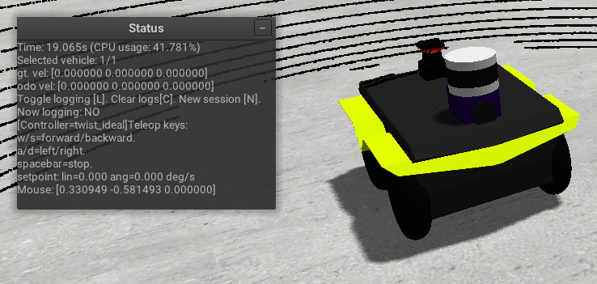

.. _world_vehicles:

Definition of vehicles
--------------------------------------------

An XML block with tag name ``<vehicle:class>`` *can* be provided for each
vehicle *class*, then each ``<vehicle>`` will *instantiate* a vehicle or robot
of a particular *class*.

Inside **<vehicle:class>** tag, there are tags **<dynamics>**,
**<friction>** and instances of **<sensor>**.

.. note:: See predefined vehicles types for XML code examples: :ref:`vehicles`.

Vehicle kinematic and dynamics
^^^^^^^^^^^^^^^^^^^^^^^^^^^^^^^^^^

At present, there are three types of vehicle dynamics implemented.
Refer [vehicle\_models] for more information.

**<dynamics>** with attribute *class* specifies class of dynamics used.
Currently available classes:

-  differential

-  car\_ackermann

-  ackermann\_drivetrain

Each class has specific inner tags structure for its own configuration.

Common
^^^^^^

Every dynamics has wheels specified with tags **<i\_wheel>** where i
stand for wheel position index (r, l for differential drive and fr, fl,
rl, rr for Ackermann-drive)

Wheel tags have following attributes:

-  *pos* - two floats representing x an y coordinate of the wheel in
   local frame

-  *mass* - float value for mass of the wheel

-  *width* - float value representing wheel width [fig:wheel\_forces]

-  *diameter* - float value to represent wheel diameter
   [fig:wheel\_forces]

Ackermann models also use **<max\_steer\_ang\_deg>** to specify maximum
steering angle.

**<chassis>** is also common for all dynamics, it has attributes:

-  *mass* - mass of chassis

-  *zmin* - distance from bottom of the robot to ground

-  *zmax* - distance from top of the robot to ground

Motion controllers
^^^^^^^^^^^^^^^^^^^

There are controllers for every dynamics type [sec:controllers]. In XML
their names are

-  raw - control raw forces

-  twist\_pid - control with twist messages

-  front\_steer\_pid - [Ackermann only] - control with PID for velocity
   and raw steering angles

Controllers with *pid* in their names use PID regulator which needs to
be configured. There are tags **<KP><KI><KD>** for this purpose. Also
they need the parameter **<max\_torque>** to be set.

Twist controllers need to set initial **<V>** and **<W>** for linear and
angular velocities respectively.

Steer controllers need to set initial **<V>** and **<STEER\_ANG>** for
linear velocity and steering angle respectively.

Ackermann-drivetrain model
^^^^^^^^^^^^^^^^^^^^^^^^^^

needs a differential type and split to be configured. For this purpose
there is a tag **<drivetrain>** with argument *type*. Supported types
are defined in [sec:ackermann\_drivetrain]. In XML their names are:

-  open\_front

-  open\_rear

-  open\_4wd

-  torsen\_front

-  torsen\_rear

-  torsen\_4wd

**<drivetrain>** has inner tags describing its internal structure:

-  **<front\_rear\_split>**

-  **<front\_rear\_bias>**

-  **<front\_left\_right\_split>**

-  **<front\_left\_right\_bias>**

-  **<rear\_left\_right\_split>**

-  **<rear\_left\_right\_bias>**

which are pretty self-explanatory.

Friction
^^^^^^^^

Friction models are described in [sec:friction\_models] and defined
outside of **<dynamics>**. The tag for friction is **<friction>** with
attribute *class*.

Class names in XML are:

-  wardiagnemma

-  default

**Default** friction [sec:default\_friction] uses subtags:

-  **<mu>** - the friction coefficient

-  **<C\_damping>** - damping coefficient

In addition to **default**, **Ward-Iagnemma** friction includes subtags:

-  **A\_roll**

-  **R1**

-  **R2**

that are described in [sec:wi\_friction].

Vehicle instances
-------------------------

For each vehicle **class**, an arbitrary number of vehicle **instances**
can be created in a given world.

Vehicle instances are defined with the **<vehicle>** tag that has attributes
*name* and *class*. *class* must match one of the classes defined
earlier with **<vehicle:class>** tag.

Subtags are:

-  **<init\_pose>** - in global coordinates: :math:`x`, :math:`y`,
   :math:`\gamma` (deg)

-  **<init\_vel>** - in local coordinates: :math:`v_x`,\ :math:`v_y`,
   :math:`\omega` (deg/s)

Logging
---------

Each vehicle is equipped with a high-rate logger, capable of streaming to CSV files
the internal variables of each vehicle and wheel, separately, for posterior analysis.

It can be started or stopped by pressing the key 'L' after getting the focus to the MVSim GUI window,
as can be seen in the control UI instructions: 

Each "logging session" will be dumped into a separate CSV file for convenience of posterior analysis.
The header of the CSV includes the variable names for each column: vehicle position and orientation, 
wheel angular velocity and acceleration, lateral and longitudinal forces, etc.

If you want to add new variables to this logger, look for ``logger->updateColumn(...)`` in the code
for usage examples.
